======================================
Legacy CNV Baseline Building handover
======================================

-----------------
Purpose
-----------------
This page provide a tutorial of how to build CNV baseline and its preliminary evaluation.
This applies to all legacy pipeline projects.

The baseline building pipeline was original a series of scripts written by past CNV team members. Ultimately, combined into a python pipeline by TsungHsun.

-----------------
Repos
-----------------
- `Bitbucket <https://bitbucket.org/actgenomics/actcnv_baseline_automation/src/master/>`_
- `Github <https://github.com/ACTGenomics/cnv_baselinebuild_legacy>`_

-----------------
Docker Images
-----------------
- `actgenomics/cnv_bsl_build <https://hub.docker.com/repository/docker/actgenomics/cnv_bsl_build>`_

----------------------------
Past memeber tutorial videos
----------------------------
These files are found in TP-FS01 storage

- /2024SF/BIA&BI/Bioinformatics/Team/TsungHsun/Handover/Baseline automation 
- /2024SF/BIA&BI/Bioinformatics/Team/August/[PanelRD]_BaselineBuilding 
- `Handover meeting video <https://teams.microsoft.com/l/meetingrecap?driveId=b%21-CV1Shz5dEa-10brA_2bRX08iiL0CrNJr-n_sGXl5mzKGf7NyeitQ4Jkr2cqo3uK&driveItemId=01FKRUDFEVXI4FMWMOZ5C3B42JBNPLBRP5&sitePath=https%3A%2F%2Factgenomics-my.sharepoint.com%2F%3Av%3A%2Fp%2Ftomlin%2FEZW6OFZZjs9FsPNJC16wxf0BxEm6CaOens3zMYQnNkWo7Q&fileUrl=https%3A%2F%2Factgenomics-my.sharepoint.com%2F%3Av%3A%2Fp%2Ftomlin%2FEZW6OFZZjs9FsPNJC16wxf0BxEm6CaOens3zMYQnNkWo7Q&iCalUid=040000008200E00074C5B7101A82E008000000002476A1A788B2DB010000000000000000100000009019CED200A9EC44B3B0B80847E33E7B&threadId=19%3Ameeting_YjczZDU3ZWItZGIwNy00ZmM1LWE2MGItMzExYTdiNmViMjA2%40thread.v2&organizerId=9902ec7c-8d3f-45e0-9d85-25196f886def&tenantId=6e3eb02e-e8ca-4043-961c-492463629974&callId=9d6028e8-6e4d-40d7-be2a-bcfcdff5a253&threadType=Meeting&meetingType=Scheduled&subType=RecapSharingLink_RecapChiclet>`_

---

------
Steps
------

Prepare raw data
=================
- Prepare a delimited list of UUIDs
- Normal sample with Lv1 and Lv2 data from production pipeline

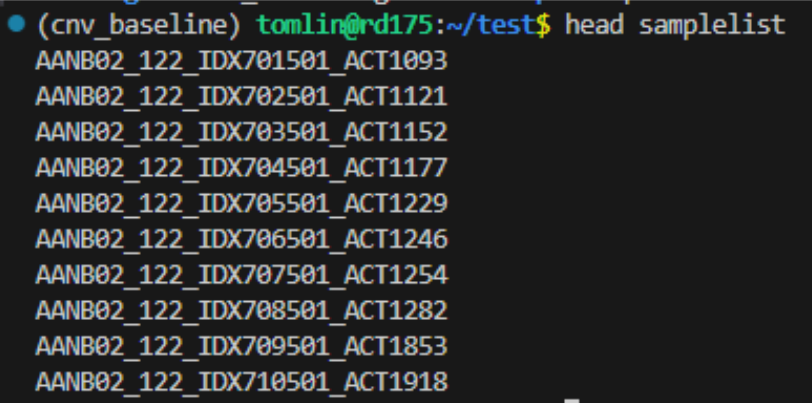

----

- Generate a physical copy in local directory and group the files into one folder

.. code-block:: console
    
    # find files
    python3 /mnt/home/tomlin/dev_script/find_files.py \ 
        -f1 [Lv1 DIR] \ 
        -f2 [Lv2 DIR] \ 
        -i samplelist \ 
        -o [output DIR]

    # create directory for build input
    cd [output DIR]; mkdir coverage_arm coverage_cnv rawbackup
    
    # here the example output directory is '/mnt/home/tomlin/handover/test'
    cp /mnt/home/tomlin/handover/test/Lv1/*/CoverageAnalysis/*/*EXON*.xls coverage_cnv 
    cp /mnt/home/tomlin/handover/test/Lv1/*/CoverageAnalysis/*/*SNP*.xls coverage_arm 
    cp /mnt/home/tomlin/handover/test/Lv2/SNV/*/*/annotation_result/*rawbackup.xlsx rawbackup 

    # create directory for build output
    mkdir -p output/{selection_cnv,selection_arm,build_cnv,build_arm,SNPdb_build} 

- Coverage directory is needed for different \*.amplicon.cov.xls for ONCOCNV baseline
- Rawbackup directory contains \*.rawbackup.xls annotation table for SNP database

Prepare building files
=======================
Building files are usually the same every time, therefore stored in repository.

- `PA037 <https://github.com/ACTGenomics/cnv_baselinebuild_legacy/tree/develop/Panels/PA037/building_files>`_
- `PA031 <https://bitbucket.org/actgenomics/actcnv_baseline_automation/src/master/Panels/PA031/building_files>`_
- `Onco2M7 <https://bitbucket.org/actgenomics/actcnv_baseline_automation/src/master/Panels/Onco2M7pv5/building_files>`_

Prepare config json
========================

The baseline building pipeline is controlled using JSON file, which list the path of the building files used by scripts in the pipeline.

JSON key explanation
~~~~~~~~~~~~~~~~~~~~~

Template of JSON files are stored in the repo: `Onco2M7pv5 template <https://bitbucket.org/actgenomics/actcnv_baseline_automation/src/master/Panels/Onco2M7pv5/json/>`_

The JSON keys are fixed variable to be referenced in the python pipeline.

- **sequencer**: Name of the sequencer (for filename labelling)
- **panel**: Name of the panel (for filename labelling)
- **baseline**: Baseline tissue type (for filename labelling)
- **location**: Deprecated (but still used in pipeline)
- **machine**: ACT Internal ID for machine type (for filename labelling)
- **sample_type**: Number of samples, normal, FFPE and PBMC are denoted with N, F and P, respectively.
- **ONCOCNV**: the ONCOCNV script to be used for baseline building (no change)
- **rm_sample**: the samples to be omitted from baseline building (usually determined after normal sample evaluation)
- **cutoff_files**: contain parameters to test for different high/low amplification efficienty and amplicon CVs.

.. note:: 

    Final cutoff files should only contain one set of parameters.

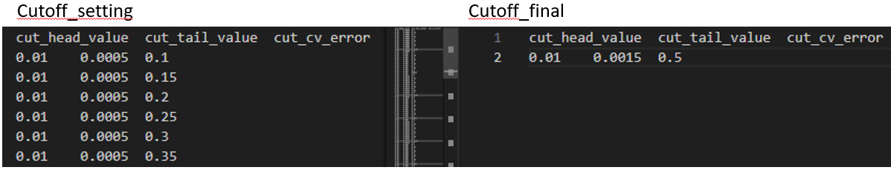

-----

- **bed**: the original BED files of amplicon inserts (all the designed amplicon for the panel)

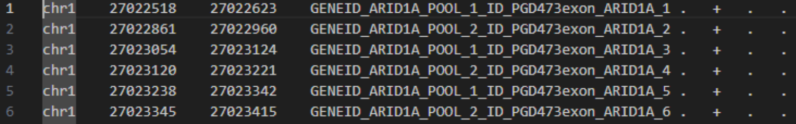

-----

- **pseudo**: the pseudo gene list of the panel

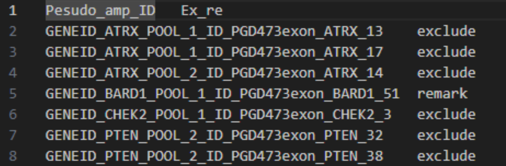

-----

- **lgr_rawbed**: BED files with exon information in amplicon name

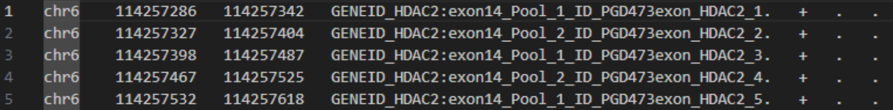

-----

- **genelist**: CNV gene list (same as GeneInfo file)

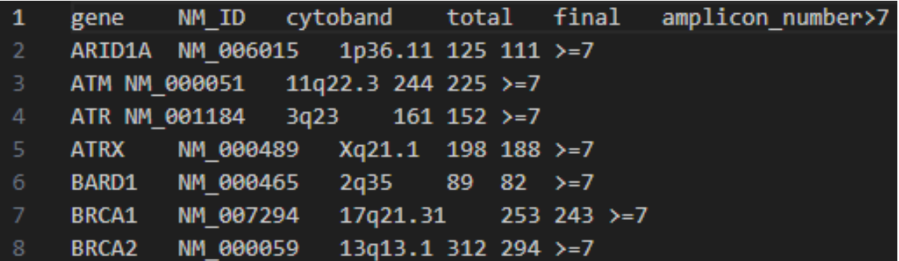

-----

- **lgr_genelist**: Gene list but with exon level info for BRCA1/2

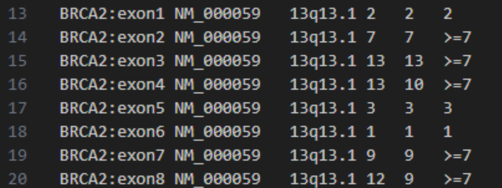

-----

- **cyto**: cytoband file label p and q arms of chromosome for ArmCNV

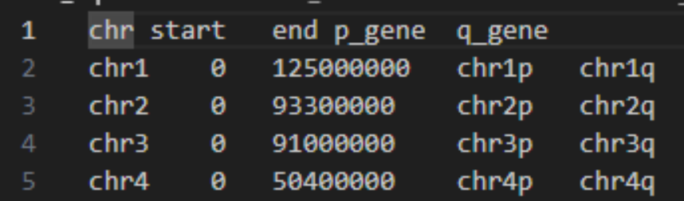

-----

- **cov_path**: path to the directory with all the amplicon.cov.xls
- **output_path**: path of the output directory
- **script_path**: path of the pipeline scripts component (fixed)
- **LOH_cut**: VAF range to define LOH SNPs
- **Homo_cut**: VAF range to define HOM SNPs
- **Het_cut**: SNP inclusion criterion -- the percentage of samples where these HET SNPs are found
- **LOH**: SNP exclusion criterion -- the number of samples where these LOH SNPs are found
- **gnomeAD**: percentage cutoff for gnomeAD database for SNP inclusion
- **Total_depth**: Deprecated (defined by SNV pipeline)
- **Variant_counts**: Deprecated (defined by SNV pipeline)
- **Strand_bias**: Deprecated (defined by SNV pipeline)
- **bed (in SNPdb json)**: new BED files built
- **gene_info (in SNPdb json)**: new GeneInfo file built
- **vcf_path (in SNPdb json)**: directory containing the rawbackup annotation table

Cutoff selection JSON
~~~~~~~~~~~~~~~~~~~~~~

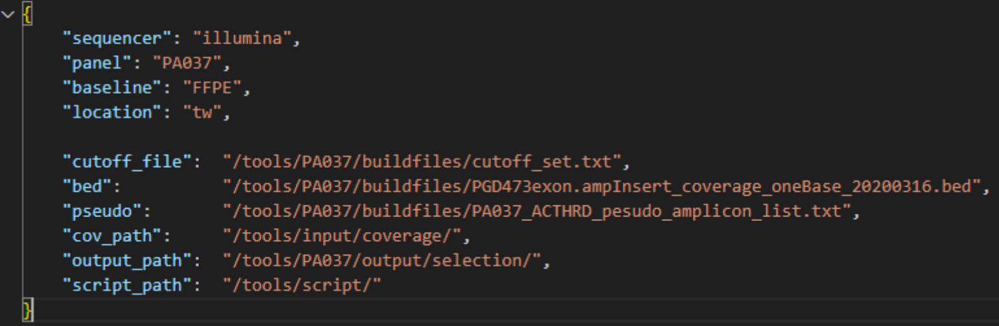

-----

Baseline building JSON
~~~~~~~~~~~~~~~~~~~~~~

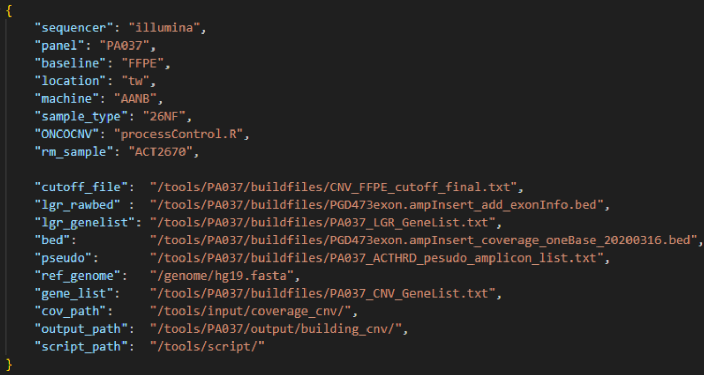

-----

SNPdb building JSON
~~~~~~~~~~~~~~~~~~~~~~

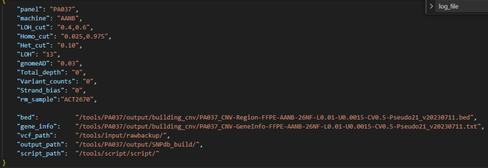

-----

Prepare deployment YAML
========================

.. note::

    The container path of the mounted volume should be the same as the path in JSON files.

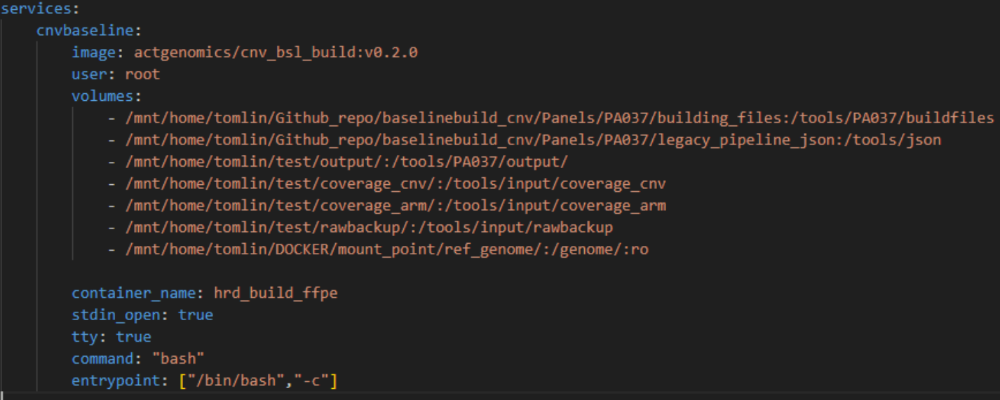

----

Deploy container
========================

.. code-block:: console

    # deploy container
    docker-compose -f [YAML file] up -d

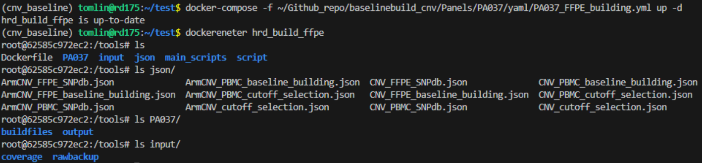

----

Build Baseline
========================

These commands are to be executed inside the baseline building container.

.. code-block:: console

    # Selection
    python3 /tools/main_script/CNV_LGR_baseline_build.py \
        -i json/CNV_cutoff_selection.json \
        -m selection 

    python3 /tools/main_script/ArmCNV_baseline_build.py \
        -i json/ArmCNV_cutoff_selection.json \
        -m selection 

    # Build
    python3 /tools/main_script/CNV_LGR_baseline_building.py \ 
        -i json/CNV_FFPE_baseline_building.json \ 
        -m baseline_building 

    python3 /tools/main_script/ArmCNV_baseline_building.py \ 
        -i json/CNV_FFPE_baseline_building.json \ 
        -m baseline_building 

    python3 /tools/main_script/SNPdb_building.py.py -i json/CNV_FFPE_baseline_building.json 

    python3 /tools/main_script/SNPdb_building_ArmCNV.py -i json/CNV_FFPE_baseline_building.json 

SNP database editing
~~~~~~~~~~~~~~~~~~~~~

Some SNPs will be assigned to the same region. Although this is technically correct, but for purpose of plot visulisation, 
this can leads to data point overlapping. The BIO/MIS team has requested each SNP is to be assigned to the nearest adjacent region.

.. code-block:: console

    python3 /mnt/home/tomlin/Github/baselinebuild_cnv/script/AddAmpliconID_SNPdb_final.py \ 
        -b [New BED] \ 
        -snp [SNPdb file] \ 
        -out [new SNPdb file path]

Evaluate Baseline
========================

1. Rerun pipeline using new baseline on normal samples
    - Example of preliminary baseline evaluation: `20250224 - ACTOnco2M7pv6 CNV baseline building (slide 11-12) <https://actgenomics-my.sharepoint.com/:p:/p/tomlin/ETzZA-kdkuBEoDewbhVZ2WgBkwGG8PsG1XKMsUhjhN9R9g?e=xoaETd>`_
    - Use production pipeline (see `Legacy CNV pipeline <https://cnv-handover.readthedocs.io/en/bsl-page/legacy_pipeline.html>`_)
    - Use Nextflow CNV pipeline - run until ONCOCNV

.. code-block:: console

    # run pipeline
    nextflow run /mnt/home/tomlin/Github_repo/actg-workflows/sub-workflows/cnvOncoCNVOnly.nf \
        -c /mnt/home/tomlin/Github_repo/actg-workflows/configs/hg19/illumina/PA037/sub-workflow/20240902_ABIE-763.json \
        -params-file /mnt/home/tomlin/handver/oncocnv_only/oncocnv_only.params.json \
        -entry ONCOCNVonly \
        --publish_dir /mnt/BI1/tomlin/oncocnv_only

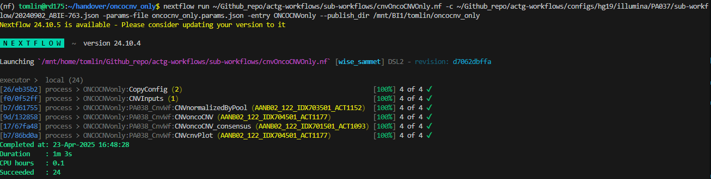

----

2. Check for actionable genes with less than 7 amplicon regions
3. Check for occurrence of gene where copy number **IS NOT** 2 across normal samples

.. code-block:: console

    python3 /mnt/home/tomlin/dev_scripts/summarystats.py \ 
        -i [DIR contain list of *summary.txt] \ 
        -o [output DIR] 

4. Discuss results with BIO/MIS
    - If amplicon regions need to be included to rescue gene from gene_tag list
    - If samples needs to be omitted, rebuild baseline
5. After normal samples and baseline are confirmed, build SNP database
6. Evaluate baseline using RM or previously sequenced clinical samples.
7. Pipeline performance can be evaluated using `SiaoYu's drylab-validation scripts <https://github.com/ACTGenomics/actg-drylab-validation>`_
8. `RMarkdown for SNP analysis <https://github.com/tomlinBI/cnv_handover/blob/master/docs/source/_src/20250219_Onco_FFPE_SNPdb_analysis.Rmd>`_

----

Repo update
========================

Illumina
~~~~~~~~~~

- Move old baseline to ``illumina_cnv_integration/cnv_files/[Panel]/old_baseline``
- Move new baseline to ``illumina_cnv_integration/cnv_files/[Panel]/baseline``

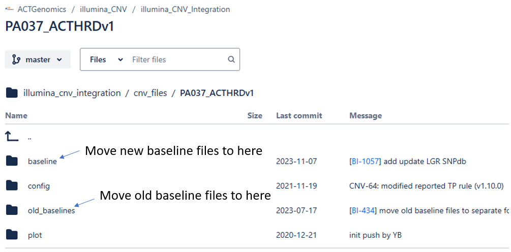

----

- For FFPE: Edit ``illumina_cnv_integration/cnv_files/[Panel]/baseline/conf.json`` to update the baseline filename
- For PBMC: Edit ``illumina_cnv_integration/cnv_files/[Panel]/baseline/conf_pbmc.json`` to update the baseline filename

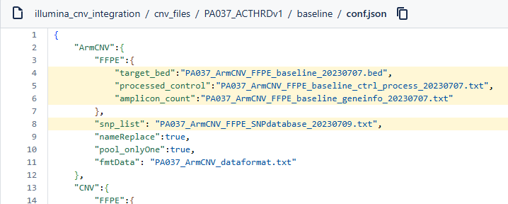

----

- Edit system config for version labelling ``illumina_cnv_integration/setting/cnv_app/system/config.json``

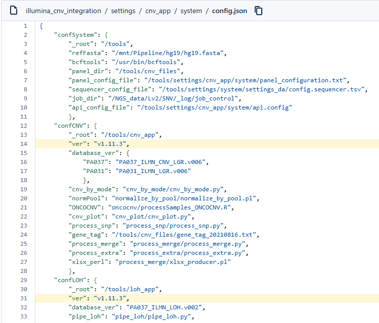

----

Torrent
~~~~~~~~~~

- Move old baseline files to ``[repo]/baseline/oldbaseline``
- Move new baseline files to ``[repo]/baseline/baseline``

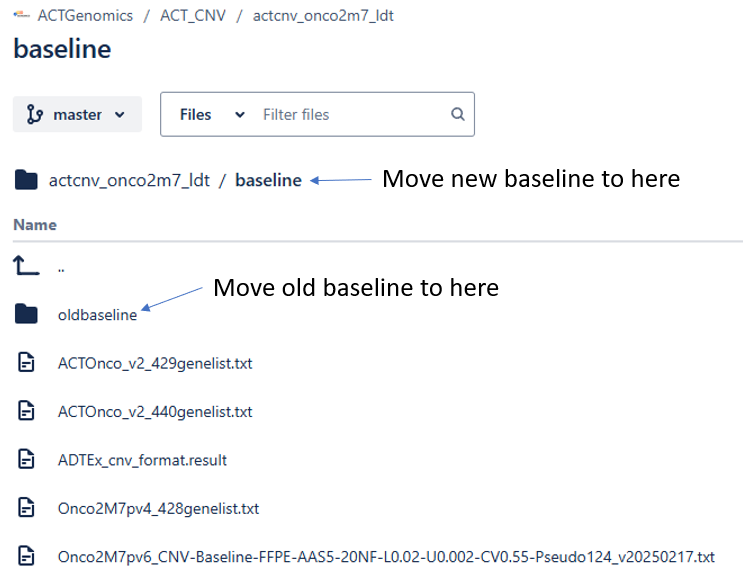

----

- Edit pipeline script with new baseline filename
    - **Onco**
        - ``actcnv_onco2m7_ldt/script/ACTOnco_CNV_Onco2M7.py``
        - ``actcnv_onco2m7_ldt/script/ACTOnco_LOH_Onco2M7.py``
        - ``actcnv_onco2m7_ldt/script/ACTOnco_Merge_Onco2M7.py``

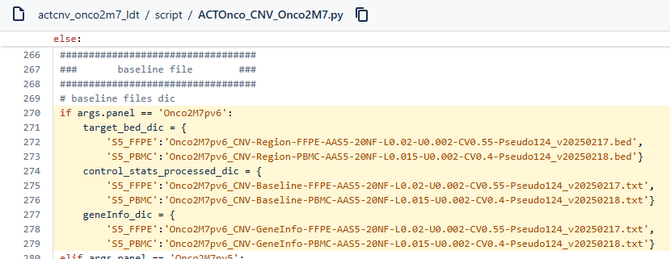

----    

    - **DrugV4**
        - ``actcnv_drug_ldt/script/ACTDrugV4_CNV_PA27M1.py``
        - ``actcnv_drug_ldt/script/ACTDrugV4_LOH_PA27M1.py``

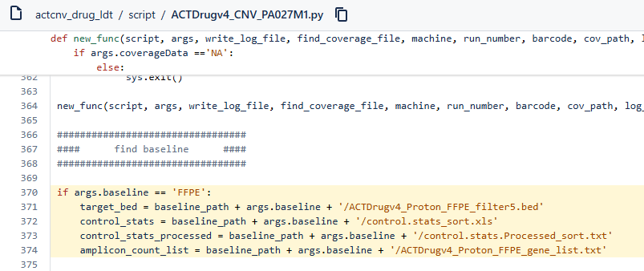

----

- Edit version_info.txt for new version gene_tag

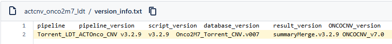