======================================
Legacy CNV pipeline handover
======================================

-----------------
Purpose
-----------------

Provide a tutorial of how to deploy and troubleshoot during maintenance and testing of Illumina and Torrent legacy CNV pipeline

-----------------
Files
-----------------

- YAML

.. code-block:: console 
    
    /mnt/home/tomlin/dockercompose/

- Testing data

.. code-block:: console

    /mnt/BI3/Team_workdir/tom_workdir/Validation_input/

-----------------
Bitbucket Repos
-----------------

- `Illumina CNV Integration <https://bitbucket.org/actgenomics/illumina_cnv_integration/src>`_

- `Torrent ACTOnco2M7 <https://bitbucket.org/actgenomics/actcnv_onco2m7_ldt/src/master/>`_

- `Torrent ACTDrugV4 <https://bitbucket.org/actgenomics/actcnv_drug_ldt/src/master/>`_

-----------------
Docker Images
-----------------
- `actgenomics/ilmn_cnv <https://hub.docker.com/repository/docker/actgenomics/ilmn_cnv/general>`_

- `actgenomics/ldt_torrent_actcnv_onco <https://hub.docker.com/repository/docker/actgenomics/ldt_torrent_actcnv_onco/general>`_

- `actgenomics/ldt_torrent_actcnv_drug <https://hub.docker.com/repository/docker/actgenomics/ldt_torrent_actcnv_drug/general>`_

-----------------
Deployment
-----------------
Use the following docker compose template to initiate container

**Illumina** - `v1.11.3 (54022ed) <https://bitbucket.org/actgenomics/illumina_cnv_integration/src/v1.11.3/>`_ 

.. code-block:: console

    docker-compose -f /mnt/home/tomlin/dockercompose/ilmn_testing.yml up -d

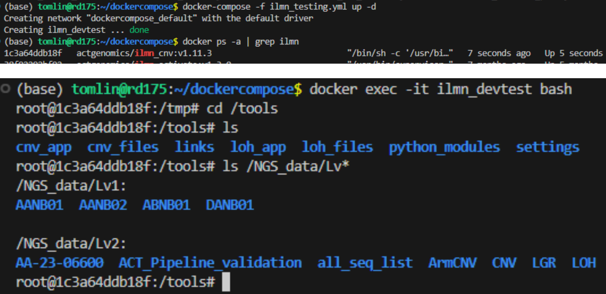

----

**Torrent Onco** - `v3.2.9 (1a5b490) <https://bitbucket.org/actgenomics/actcnv_onco2m7_ldt/src/v3.2.9/>`_

.. code-block:: console

    docker-compose -f /mnt/home/tomlin/dockercompose/ACTOnco_testing.yml -d

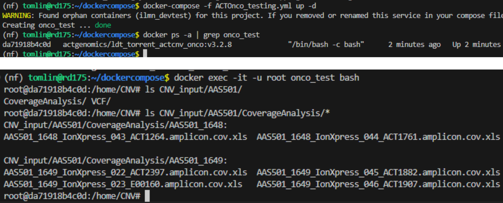

----

**Torrent DrugV4** - `v3.0.9 (5ef3649) <https://bitbucket.org/actgenomics/actcnv_drug_ldt/src/v3.0.9/>`_

.. code-block:: console

    docker-compose -f /mnt/home/tomlin/dockercompose/ACTDrugV4_testing.yml

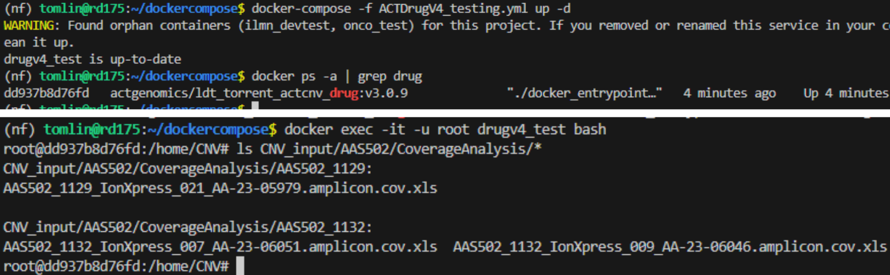

----

-------------------
Pipeline execution
-------------------

When container has been deployed, use the following command triggers a job execution.

- Illumina: All four biomarker (ArmCNV, CNV, LGR, LOH) should trigger. Data will output in the respective Lv2 directory

.. code-block:: console

    python3 /tools/cnv_app/cnv_pipeline/cnv_pipeline.py -i [RunBarcode] --panel [panelID]

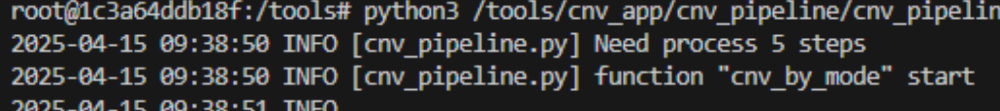

----

- Torrent: For Torrent pipelines, if panel ID is not provided, it will be inferred via the all_seq_list

.. code-block:: console
    
    python /home/CNV/script/ACTOnco_CNV_Onco2M7.py -i [RunBarcode] -b FFPE -p Onco2M7pv6

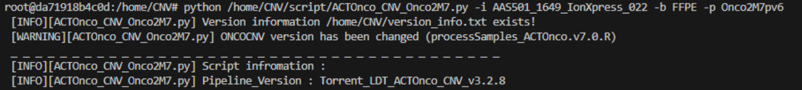

----

.. code-block:: console
    
    python /home/CNV/script/ACTDrugV4_CNV_PA027M1.py -i [RunBarcode] -b FFPE -p PA027M1

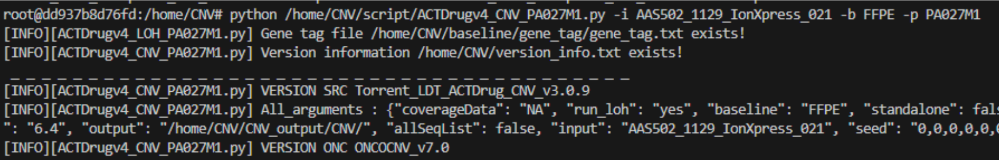

----

-----------------
Troubleshoot
-----------------

Server DNS Configuration
~~~~~~~~~~~~~~~~~~~~~~~~~

Server needs to contain necessary DNS for API in /etc/hosts

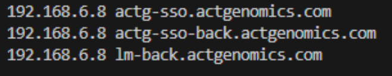

Otherwise add the following to docker-compose

.. code-block:: YAML

    extra_hosts:
    
      - "actg-sso-back.actgenomics.com=192.168.6.8"
    
      - "actg-sso.actgenomics.com=192.168.6.8"
    
      - "lm-back.actgenomics.com=192.168.6.8"

Mount volumes exist
~~~~~~~~~~~~~~~~~~~~~

The mock directory of Lv1 and Lv2 contained test data for pipeline execution

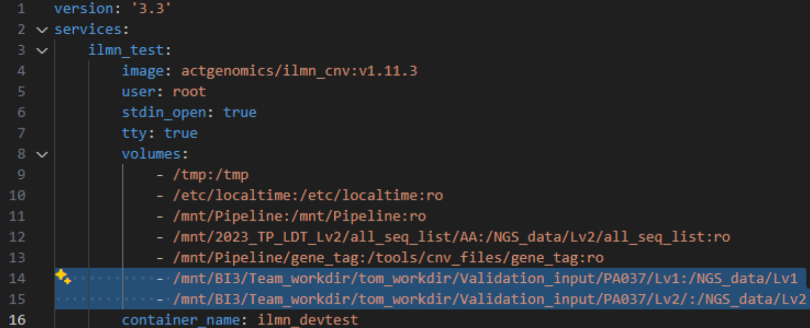

----

Image building
~~~~~~~~~~~~~~~~~~~~

When building Illumina CNV container, it needs to contain an entry point as it works as a component in the entire pipeline.

The dockerfile to use when building production container: 

.. code-block:: console
    
    illumina_cnv_integration/cnv_df/docker_swarm/Dockerfile

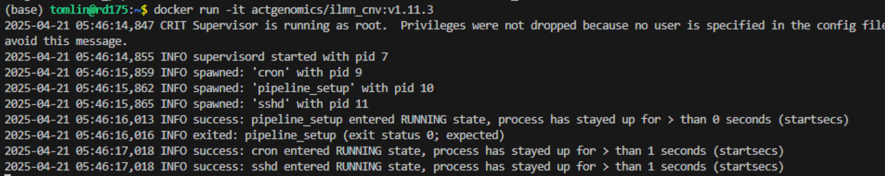

----

For development and local testing, without crontab entrypoint:

.. code-block:: console

    illumina_cnv_integration/cnv_df/Dockerfile

Test new data / Debug sample run
~~~~~~~~~~~~~~~~~~~~~~~~~~~~~~~~~

When new data is required for testing, a mock directory can be created providing the sample data is already in production volumes
Generate text file with 1-column containing sample UUID.  Example UUID : AANB01_502_IDX703503_AA-25-10005

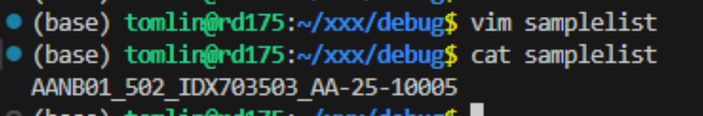

----

Use custom script to generate mock folder. This directory will contain a physical copy of Lv1 Lv2 files with samples, which can be mounted to testing container

.. code-block:: console

    python3 /mnt/home/tomlin/dev_script/file_files.py \
        -f1 [Lv1 DIR] \
        -f2 [Lv2 DIR] \
        -i [File containing list of UUIDs] \
        -o [Output DIR]

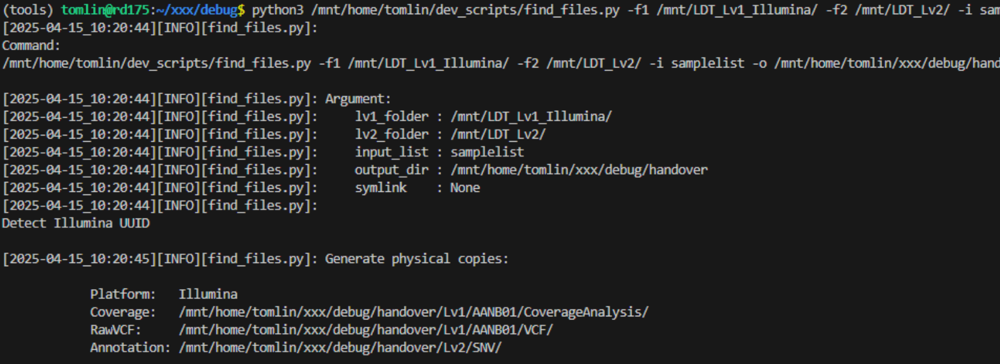