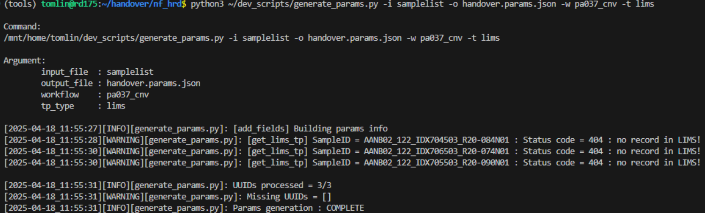
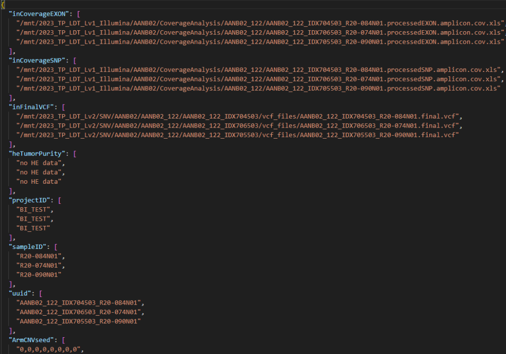
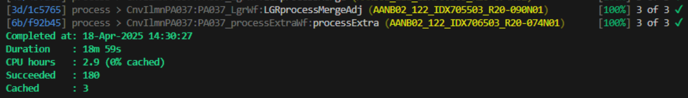

======================================
Nextflow HRD CNV pipeline handover
======================================

-----------------
Purpose
-----------------

This document demonstrate the basic understanding of running the nextflow CNV pipeline for ACTHRD

----

-----------------
Repo
-----------------

- `Nextflow CNV pipeline <https://github.com/ACTGenomics/cnv_pipeline>`_
- `Nextflow actg-workflow <https://github.com/ACTGenomics/actg-workflows>`_

-----------------
Docker Image
-----------------

Stable version : `v1.4.6 <https://hub.docker.com/repository/docker/actgenomics/cnv_pipeline/general>`_

-----------------
Others materials
-----------------

- Design document : `ACTHRD SDS CNV <https://actgenomics-my.sharepoint.com/:w:/p/tomlin/ER_4WdLkL79i9UNl_KAgPaoBLUeNBe4t8bpat7Ew21YPSA?e=KKfSnb>`_
- Basic CNV pipeline concept : `RD and TT team traning materials <https://actgenomics-my.sharepoint.com/:p:/p/tomlin/EcTWI-KEp3NZjLpvSCSIb5MBff533n2f3rpfNFyqu2eJig?e=bS4iVH>`_

----

-----------------
Files
-----------------

These refers to the files found in the `actg-workflow` repo

- **Subworkflow**: ``actg-workflows/sub-workflows/cnvIlmnSubF.nf``
- **Modules**: ``actg-workflows/modules/CNVmodules_merged.nf``
- **Configs**: ``actg-workflows/configs/hg19/illumina/PA037/sub-workflow/20240902_ABIE-763.json``

Processes
~~~~~~~~~~~~~~

These processes are components of the CNV pipeline Subworkflow

- **replaceNameAmp**: Renames the gene ID for ArmCNV plot
- **normalizedByPool**: Performs library size normalization on read count data
- **oncoCNV_repeats**: Calculates ONCOCNV 10 times
- **oncocnv_consensus**: Obtains the most common ONCOCNV profile as representative
- **cnvplot**: Generates CN plot
- **chrplot**: Generates CN plot across chromosomes for ArmCNV
- **lgrplot**: Generates CN plot for BRCA1/2
- **processSNP**: Processes VCF file, calculates SNPs and tumor purity
- **snpplot**: Generates SNP plot
- **processMerge**: Calculate gene zygosity status and generates summaryMerge table
- **detect_BaselineShift**: Predicts baseline shift using SNP
- **adjustProfile**: Adjusts ONCOCNV profile based on baseline shift result
- **processSNP_adjust**: Recalculates tumor purity
- **processMergeAdj**: Recalculates gene zygosity, summaryMerge table
- **procesExtra**: Combines plots together

----

--------------------
Prepare params file
--------------------

A custom script generate different types of params file, given the UUID and workflow type. 

.. note::

    The script generate paths from production volumes, therefore the samples should already been processed by legacy pipeline.

.. code-block:: console

    python3 /mnt/home/tomlin/dev_scripts/generate_params.py \ 
        -i [List of UUID] \ 
        -o [Output params file path] \ 
        -w [workflow type] \ 
        -t [tumor purity source] 

----

-----

--------------------
Configs fields
--------------------

These config in the sub-workflow should be the same as the one found in main-workflow config 

- **refFa**: Reference genome 
- **inGeneTag**: Latest gene_tag list provided by MIS 
- **oncocnvR**: ONCOCNV version, the name should refer to the filename found in cnv_pipeline image 
- **ArmCNVinTargetBed**: ArmCNV target region BED file, obtained after baseline building 
- **ArmCNVinProcessedControl**: ArmCNV ONCOCNV baseline file 
- **ArmCNVinAmpliconCount**: ArmCNV GeneInfo file baseline file 
- **ArmCNVinSnpList**: ArmCNV SNP database baseline file 
- **ArmCNVinFmtData**: Contains list of columns to be reported in ArmCNV summaryMerge table 
- **CNVinTargetBed**: CNV target region BED file, obtained after baseline building 
- **CNVinProcsesedControl**: CNV ONCOCNV baseline file 
- **CNVinAmpliconCount**: CNV GeneInfo baseline file 
- **CNVinSnpList**: CNV SNP database baseline file 
- **CNVinFmtData**: Contains list of columns to be reported in CNV summaryMerge table 
- **LGRinTargetBed**: LGR target region BED file, obtained after baseline building 
- **LGRinProcessedControl**: LGR ONCOCNV baseline file, should contain exon level info for BRCA1/2 
- **LGRinAmpliconCount**: LGR GeneInfo baseline file 
- **LGRinSnpList**: LGR SNP database baseline file 
- **LGRinFmtData**: Contains list of columns to be reported in LGR summaryMerge table 
- **cnv_configs**: Master config file for CNV pipeline, control rules, plots 
- **name_revise**: To rename CNV gene for CNV plot 
- **processExtra_config**: Config to trigger plot merge function 
- **cnv_container**: Defines the version of CNV image to deploy 

----

--------------------
Execution
--------------------

Server should already have native nextflow installed, if not uses conda to create a Nextflow run environment

.. code-block:: console

    nextflow run /mnt/home/tomlin/Github_repo/actg-workflows/sub-workflows/cnvIlmnSubWF.nf \ 
        -c ~/Github_repo/actg-workflows/configs/hg19/illumina/PA037/sub-workflow/20240902_ABIE-763.json \ 
        -params-file handover.params.json \ 
        -entry CnvIlmnPA037 \ 
        --publish_dir /mnt/BI1/tomlin/hrd_test 

